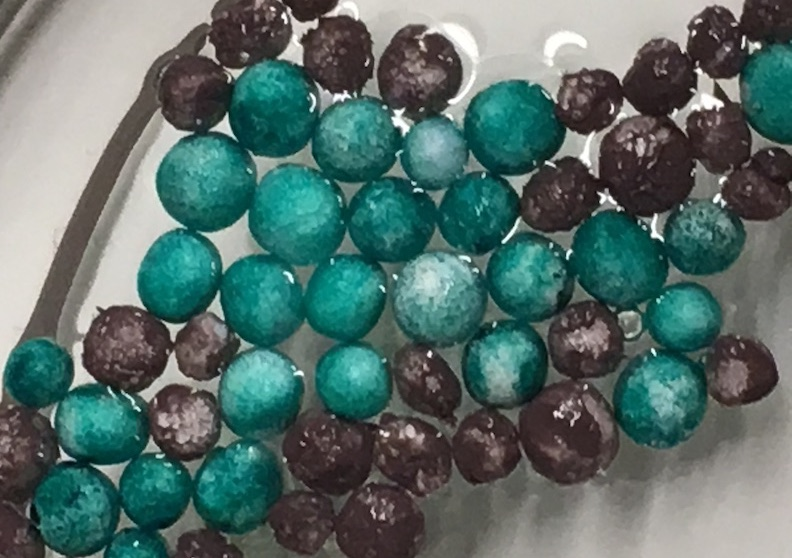
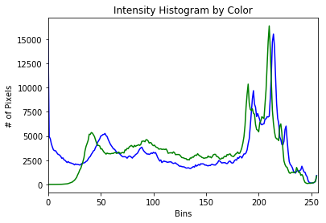
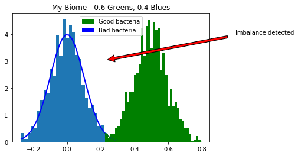

# Bio-Me

Rapid oral microbiome detection prototype submission for Hack HPI 2017 hackathon.

## Bacteria up close

## Spectrophotometry

Histogram corresponding with immunohistochemistry labels

## Notification

Notification corresponding with system readouts.

## Equipment

- Rasbperry Pi
- Ultrasonic transducer

## Contributors

@AdityaKurude, Jana, @SaiKamat, @JustinShenk
